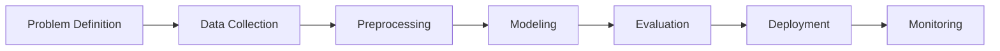

## An end-to-end ML workflow to predict 30-day hospital readmission using the UCI Diabetes Readmission dataset.

[Hospital_Readmission_Prediction_Report (2) (1).pdf](https://github.com/user-attachments/files/23281911/Hospital_Readmission_Prediction_Report.2.1.pdf) # Answers to Hospital Readmission Prediction (UCI Diabetes) Project questions

## Live App
- Deployed on Streamlit: https://alpha-readmission-prediction.streamlit.app/

## Objectives
- Improve patient outcomes by flagging high-risk readmissions.
- Reduce costs from avoidable readmissions.
- Support clinicians with data-driven decision support.

## Stakeholders
- Hospital administrators
- Clinicians and care coordinators

## KPI
- Primary: Precision on positive ("<30") readmission predictions.

---

## Project Structure
```
readmission_rf/
  README.md
  requirements.txt
  app.py
  src/
    __init__.py
    config.py
    data.py
    pipeline.py
    train.py
    evaluate.py
  data/
    diabetic_data.csv        # place dataset here (not included)
    processed/
  models/
  logs/
```

## Setup
1) Create and activate a virtual environment (recommended).
2) Install requirements:
```
pip install -r requirements.txt
```

## Data
- Download the UCI Diabetes Readmission dataset and place `diabetic_data.csv` under `data/`.
- Source: https://archive.ics.uci.edu/dataset/296/diabetes+130+us+hospitals+for+years+1999-2008

## Preprocessing
- Drop high-missing columns: `weight`, `payer_code`, `medical_specialty`.
- Replace `?` with NaN and impute:
  - Numeric: median
  - Categorical: most frequent
- Encode categoricals via label-style encoding (OrdinalEncoder) suitable for tree models.
- Feature engineering:
  - `prior_visits` = sum of `number_outpatient`, `number_emergency`, `number_inpatient`
  - `length_of_stay` = `time_in_hospital`
  - `medication_count` = count of medication columns where value != "No"
- Target: `readmitted` mapped to 1 for `<30`, else 0.

## Training
- Split: 70/15/15 (train/val/test) with stratification on target.
- Model: RandomForestClassifier
- Hyperparameters tuned: `n_estimators`, `max_depth` (GridSearchCV, precision focus).
- Artifacts saved to `models/`.
- Splits saved to `data/processed/`.

Run training:
```
python -m src.train
```

## Evaluation
- Metrics: precision, recall, f1, confusion matrix.
- Outputs written to console and `logs/metrics.jsonl`.

Evaluate on saved test split:
```
python -m src.evaluate
```

## Streamlit App
Start the UI (after training):
```
streamlit run app.py
```
Features:
- Upload CSV with same schema as raw dataset.
- Scores each row for 30-day readmission risk.
- Shows aggregate precision/recall if ground truth provided.

Live deployment:
- https://alpha-readmission-prediction.streamlit.app/

## Monitoring and Concept Drift
- Inference logs appended to `logs/metrics.jsonl` with timestamps.
- Recommended: periodic re-evaluation and scheduled re-training; track data schema drift (e.g., via statistical tests) and model performance drift.

## Ethics & Bias
- Risk: underrepresentation may harm minority groups.
- Mitigations:
  - Rebalance training (e.g., stratified sampling/SMOTE for derived groups).
  - Fairness-aware evaluation across subgroups (ethnicity, gender, age).
  - Human-in-the-loop for overrides.
- Privacy & Compliance:
  - Ensure PHI is encrypted at rest and in transit.
  - Access controls, audit logging, and de-identification for ML artifacts.
  - Follow HIPAA and local policies.

## Workflow Diagram


## Reflection
- Challenge: Feature engineering requires domain expertise (comorbidity index, discharge disposition).
- Improvement: Allocate more time for hyperparameter tuning and clinician feedback loops.

## Notes
- This repo does not include the dataset. Place `diabetic_data.csv` under `data/` before running.

Report pdf:  [Uploading Hospital_Readmission_Prediction_Report (2) (1).pdf…]()

